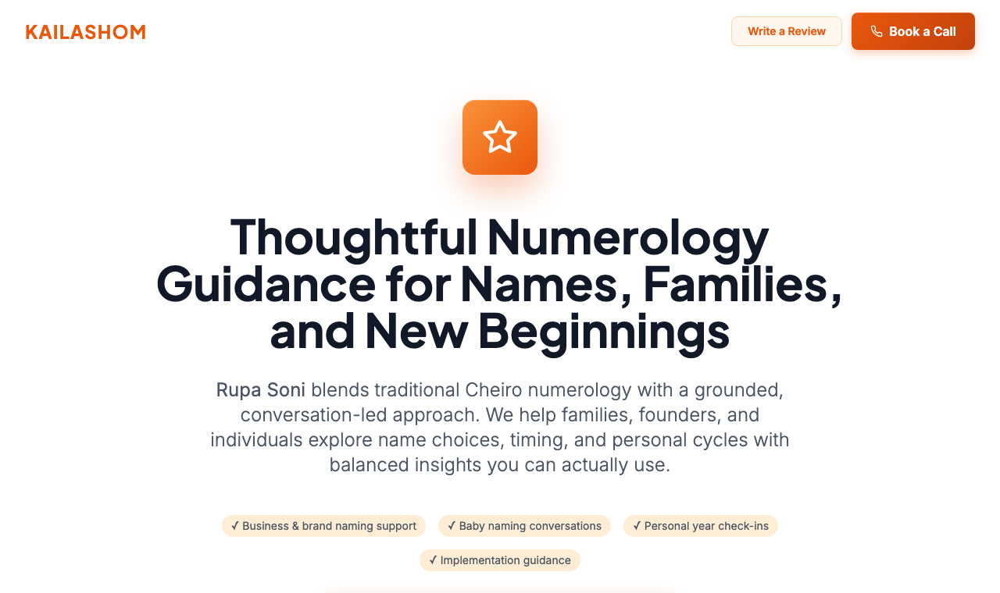

<h1 align="center">Kailashom</h1>
<p align="center"><b>Numerology guidance for names, families, and new beginnings, minus the drama.</b></p>
<p align="center">
  <code>● Live</code> &nbsp;·&nbsp; <a href="https://kailashom.com"><b>kailashom.com</b></a> &nbsp;·&nbsp; React · Vite · Firebase
</p>



> A calm, conversation-led numerology practice on the web: pick a business name, a baby name, or a fresh spelling of your own, and get grounded reasons behind each suggestion instead of dramatic forecasts.

Kailashom is the home of Rupa Soni, a numerologist who blends traditional Cheiro numerology with a listening-first approach. The site introduces her services, walks visitors through how a session works, shows real client experiences, and drops them straight into a WhatsApp chat or a booked call.

## Why it exists
Most numerology online leans on fear and vague predictions. Rupa's practice is the opposite: naming a company, a newborn, or yourself is a real decision, and people want a clear, practical second opinion, not a horoscope. Kailashom gives that practice a trustworthy front door where visitors can understand the method, read genuine reviews, and reach out in one tap.

## How it works
```
Land on site  ->  Read services + method  ->  Tap WhatsApp / Book a Call  ->  Consultation + name analysis
```
| Step | What happens |
|------|--------------|
| Land on site | A focused landing page opens with the offer and clear calls to action. |
| Read services + method | Visitors see the three services and the four-step process, explained in plain language. |
| Reach out | A tap opens WhatsApp or a call, so there is no form to wrestle with. |
| Consultation + analysis | Rupa maps key numbers and names, then shares curated suggestions and next steps. |

## What you get
| Feature | What it does |
|---------|--------------|
| Business name numerology | Name ideas that fit the brand story and supportive number patterns, with launch-timing notes. |
| Newborn baby naming | Names and spellings that respect family tradition while aligning with the child's birth numbers. |
| Personal name correction | A look at signatures, spellings, and personal years to spot gentle adjustments. |
| Real client reviews | Visitors can read recent experiences and submit their own via a review page. |
| One-tap contact | WhatsApp and call buttons throughout, plus an FAQ that answers the common questions up front. |

## Under the hood
React · Vite · TypeScript · Tailwind · Firebase (reviews + admin) · deployed on Vercel. Heavily SEO-tuned for discovery in India.
